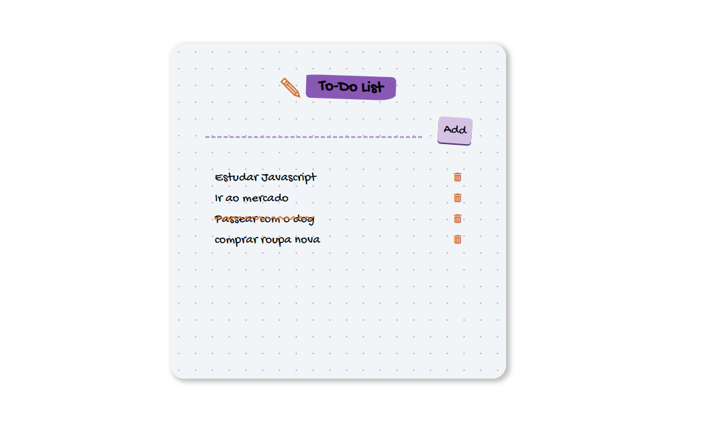

# Desafio 100 Days of Code - Jornada Front-end 🚀

Bem-vindo ao meu repositório para o Desafio "100 Days of Code"! Este projeto é a minha jornada empolgante rumo à um conhecimento sólido  no desenvolvimento front-end, começando desde as bases e progredindo para níveis avançados.

## Objetivo do Desafio

O objetivo principal é solidificar meus conhecimentos em front-end ao longo de 100 dias consecutivos de codificação. Durante este desafio, pretendo explorar as tecnologias mais relevantes no cenário atual e aplicá-las em projetos práticos.

## O que Esperar

1. **Projetos Diários**: Cada dia será dedicado a um projeto prático, abrangendo conceitos fundamentais do front-end.
2. **Aprendizado Contínuo**: Vou compartilhar meus insights, desafios e aprendizados diários no README, proporcionando uma visão transparente do processo de aprendizado.
3. **Código Fonte Aberto**: Todos os projetos estarão disponíveis aqui, com documentação clara e estrutura organizada.

## Tópicos Abordados

- HTML5 e Semântica
- CSS3 e Pré-processadores
- JavaScript ES6+
- Frameworks Front-end (por exemplo, React, Vue)
- Responsividade e Design Adaptativo
- Ferramentas de Build (Webpack, Babel)
- Controle de Versão com Git
- Boas Práticas de Desenvolvimento e Padronização de Código

## Como Acompanhar

Fique à vontade para explorar o código, clonar o repositório e sugerir melhorias. Se quiser seguir minha jornada diária, confira as atualizações neste README e em minhas redes sociais.

Agradeço por fazer parte dessa jornada incrível! Vamos codificar juntos! 💻✨


<hr>

  ### indice
  
  [Dia 01 - Formulário com validação](#dia01)<br>
  [Dia 02 - Light Mode/Dark Mode ](#dia02) <br>
  [Dia 03 - Tela de Login com validação em JavaScript e alternância de modo dark e light](#dia03)<br>
  [Dia 04 - Crônometro](#dia04)<br>
  [Dia 05 - TO-DO list](#dia05)<br>


<hr>


  ## Dia 01 -
  
Hoje, no primeiro dia do Desafio "100 Days of Code", mergulhei no estudo de formulários HTML e implementei uma página Landing Page de Captura com formulário simples com validações básicas. Aqui está um resumo do que foi abordado:
### Aprendizados do dia 

**Formulários HTML**

* Revisão dos elementos fundamentais de um formulário HTML, como  form,input, label, e button.
* Exploração de diferentes tipos de campos de entrada, como text, email e password.
* Validações Básicas
* Implementação de validações simples usando atributos HTML, como required e pattern.
* Garantia de que os campos obrigatórios não são deixados em branco.
* Validando o formato do e-mail usando expressões regulares.

**Código do Projeto** 


```html 
<!-- index.html -->


        <form action="POST">
          <input type="email" name="email" id="" placeholder="E-mail" required >
          <input type="text" name="name" placeholder="Nome" required pattern="[A-Za-z\s]+">
          <input required id="phone" name="phone" placeholder="(99) 9999-9999" pattern="(\([0-9]{2}\))\s([9]{1})?([0-9]{4})-([0-9]{4})">
        
          <label for="aulas">Qual a aula mais te interessa? </label>
          <select name="aulas" id="aulas">
            <option value="Selecione">Selecione</option>
            <option value="Planejamento e materiais">Planejamento e Materiais </option>
            <option value="Seleção das melhores plantas">Seleção das Melhores Plantas</option>
            <option value="Preparação do solo">Preparação do Solo</option>
            <option value="Plantio e germinação">Plantio e Germinação</option>
            <option value="Cuidados diários">Cuidados Diários</option>
      </div>

        </select>
        <button type="submit">Enviar</button>


      </form>
```

**Próximos passos**
Este foi apenas o primeiro passo da jornada! Nos próximos dias, pretendo aprofundar meu conhecimento em front-end, explorando novos conceitos e aplicando-os em projetos práticos. 💻✨

<hr>

## Dia 02 -

### Aprendizados do dia 

* 🎨 Aprofundei-me nas propriedades de CSS, utilizando os tutoriais do w3schools. Consegui abordar uma boa parte das seções básicas e resolvi 60 exercícios, esclarecendo várias dúvidas.
* 📱 Explorei mais o conceito de Design Responsivo, aprimorando minhas habilidades.
* 🔄 Reforcei meus conhecimentos em manipulação de DOM.
* 💡 Como projeto prático, fiz um mini-site para mudar o padrão de cores utilizando manipulação de DOM!
 
 **Projeto**
 Este projeto é um exemplo simples de como alternar entre temas claro e escuro em uma página da web utilizando JavaScript para manipular o DOM (Document Object Model). Ele demonstra como aplicar estilos dinamicamente, atualizar conteúdo e responder a eventos do usuário para criar uma experiência de usuário personalizada. O código inclui a definição de dois temas diferentes, lightTheme e darkTheme, e a funcionalidade de alternar entre eles ao clicar em um botão. 
 
 ```js 
const clickButton = document.getElementById('click');
const rootElement = document.documentElement;
const h1Element = document.querySelector('h1');

const lightTheme = {
  '--background-color': '#Efe9e1',
  '--text-color': '#121212',
  '--button-background-color': '#E6A4B4',
  '--button-text':'Dark',
  '--h1-text': 'Welcome to Light Theme!😵'
};

const darkTheme = {
  '--background-color': '#191919',
  '--text-color': '#Efe9e1',
  '--button-background-color': '#404B69',
  '--button-text':'Light',
  '--h1-text': 'Welcome to Dark Theme!😉'
  
};

let isDarkMode = false;

clickButton.addEventListener('click', function() {
  isDarkMode = !isDarkMode;
  isDarkMode ? changeTheme(darkTheme) : changeTheme(lightTheme);
});

function changeTheme(theme) {
  for (let prop in theme) {
    rootElement.style.setProperty(prop, theme[prop]);
  }
  // Atualiza o texto do botão e do h1 conforme o tema
  clickButton.textContent = theme['--button-text'];
  h1Element.textContent = theme['--h1-text'];
}


```
<hr>

##  Dia 3 -

Neste terceiro dia do meu projeto 100 Days of Code, continuei trabalhando no desenvolvimento de um formulário de login com validações de entrada e adicionei funcionalidades para permitir que o usuário escolha entre os modos claro e escuro.

### Funcionalidades Implementadas

 **Validação de E-mail e Senha**

- Implementei validações para garantir que o e-mail inserido pelo usuário seja válido.
- Adicionei uma validação para garantir que a senha inserida tenha pelo menos 8 caracteres.

**Modo Claro e Escuro**

- Adicionei um botão de alternância para permitir que os usuários mudem entre os modos claro e escuro.
- Personalizei o tema da aplicação para cada modo.

## Tecnologias Utilizadas

- HTML
- CSS
- JavaScript

### Como Utilizar

1. Clone este repositório para o seu computador.
2. Abra o arquivo HTML no seu navegador.
3. Experimente preencher o formulário de login e observe as validações em ação.
4. Experimente alternar entre os modos claro e escuro para ver a mudança no tema da aplicação.

### Códigos Importantes

 **Validação de E-mail e Senha**

```javascript
// Função que valida e-mail
function isEmailValid(email) {
  const emailRegex = /^[a-zA-Z0-9._-]+@[a-zA-Z0-9._-]+\.[a-zA-Z]{2,}$/;
  return emailRegex.test(email);
}

// Função que valida a senha 
function validatePassword(password, minNumbers) {
  return password.length >= minNumbers;
}

```
**Alternância entre modo Claro e Escuro**
``` javascript
const clickButton = document.getElementById('checkbox');
const rootElement = document.documentElement;

const lightTheme = {
  // Definição das variáveis de cores para o tema claro
};

const darkTheme = {
  // Definição das variáveis de cores para o tema escuro
};

let isDarkMode = false;

clickButton.addEventListener('change', function() {
  isDarkMode =! isDarkMode;
  isDarkMode ? changeTheme(darkTheme) : changeTheme(lightTheme);
});
```
### Próximos Passos 
* Implementar mais funcionalidades de segurança, como verificação de força de senha.
* Melhorar a acessibilidade da aplicação para usuários com necessidades especiais. 
* 
<hr>

## Dia 04 - 

**Aprendizados do dia**
* Hoje o dia foi de estudar sobre lançamento e tratamento de erros, além de explorar as funções de setInterval e setTimeOut. 
* Como projeto prático, criei um cronômetro básico utilizando HTML, CSS e JavaScript. 

### Projeto 
Criei um cronômetro simples com três botões: "start", "pause" e stop. O cronômetro inicia com 00:00:00 e pode ser iniciado, pausado e reiniciado conforme necessário. 

### Funcionalidades
* Start: Inicia o cronômetro a partir de 00:00:00. Se o cronômetro foi previamente parado, ele reinicia do zero.
* Pause: Pausa o cronômetro, mantendo a contagem atual. O cronômetro pode ser retomado a partir de onde parou pressionando o botão "start".
* Stop: Para o cronômetro e reinicia a contagem para 00:00:00.

https://github.com/nayara-nunes/100daysCode/assets/68127465/07ae58c0-d190-4c38-b978-ad4c2b78afd4


### Próximos passos
* Incrementar o projeto, criando funcionalidades de podomoro;
* Gravar quantos podomoros completos
* Colocar sons;

<hr>

## Dia 5 -

 Este projeto consiste em uma lista de tarefas simples, onde você pode adicionar novas tarefas, marcá-las como concluídas clicando sobre elas e removê-las da lista.

### Funcionalidades

- **Adicionar Tarefa**: Você pode adicionar uma nova tarefa digitando-a no campo de texto e pressionando Enter ou clicando no botão "Adicionar".
  
- **Marcar Tarefa como Concluída**: Quando você clica em uma tarefa da lista, ela é marcada como concluída e aparece com uma linha no meio do texto. Clicar novamente na tarefa remove a linha de conclusão.
  
- **Remover Tarefa**: Ao lado de cada tarefa, há um botão de lixeira. Clicar neste botão remove a tarefa da lista.

### Uso

- **Adicionar Tarefa**: Digite sua tarefa no campo de texto e pressione Enter ou clique no botão "Adicionar".
  
- **Marcar Tarefa como Concluída**: Clique na tarefa que deseja marcar como concluída.
  
- **Remover Tarefa**: Clique no ícone da lixeira ao lado da tarefa que deseja remover.

### Como Funciona

O código utiliza JavaScript para adicionar, marcar como concluído e remover tarefas dinamicamente na página. Ele também utiliza o armazenamento local do navegador para salvar as tarefas, permitindo que elas persistam mesmo após a atualização da página.

Design referência: codePen (colocar o link aqui)
### Tecnologias Utilizadas

- HTML
- CSS
- JavaScript


<hr>